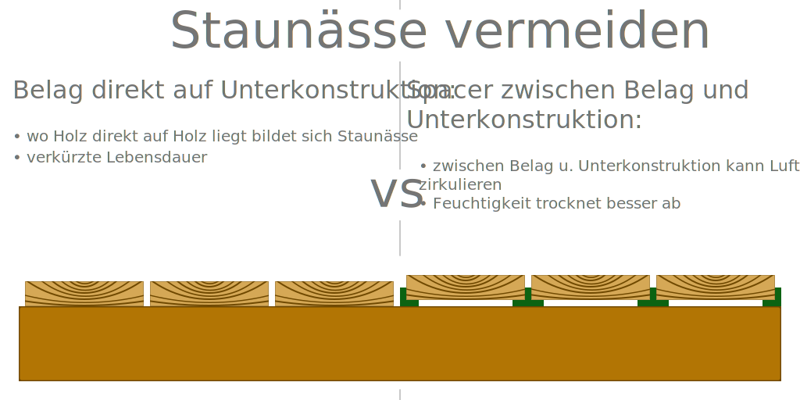

# DIY Cheatsheet

## Home And Garden

### Holzterassen

#### **Staunässe vermeiden:**

Bei Terassenbelägen aus Holz Bildet sich Stunässe an Stellen, wo Holz auf Holz trifft, z.B. wenn der Terassenbelag direkt auf der Unterkonstruktion befestigt wird

* Terassenbelag nicht direkt auf Unterkonstruktion montieren
* Abstandhalter (auch Distancer oder Spacer) zwischen Unterkonstruktion und Belag Brettern Verwenden
* Bretter so anbringen, dass der Kern nach oben zeigt (innere Jahresringe nach oben)
  * &rarr; Wenn Holz arbeitet, verzeiht es soch so, dass nach oben wölbt &rarr; wasser kann abfließen.
  * (andersherum bilden wülbt es sich nach unten, sadass Wasser darauf stehen bleibt) 